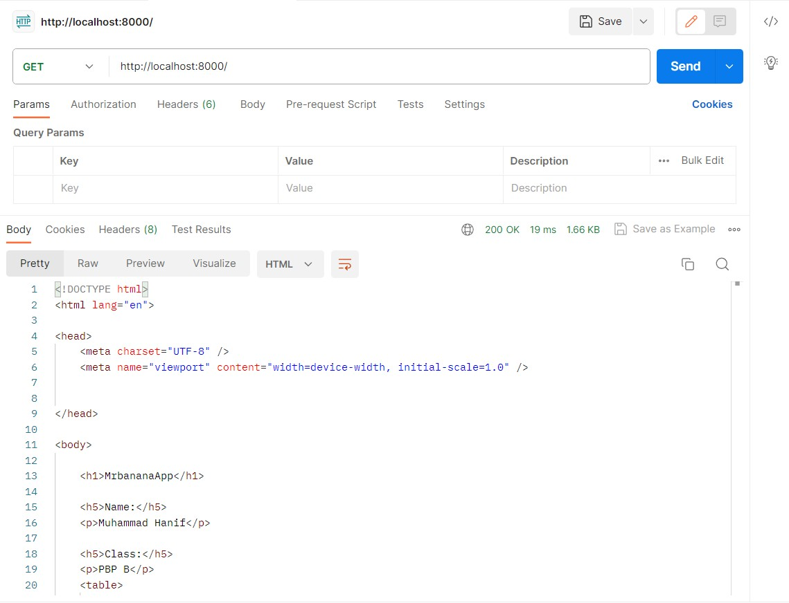
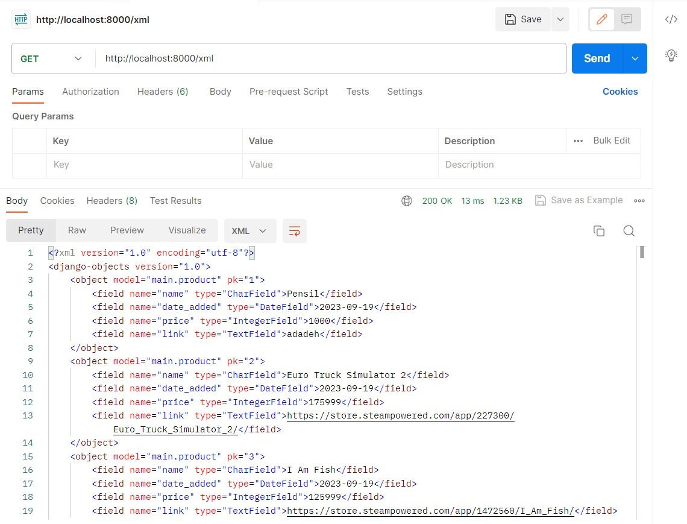
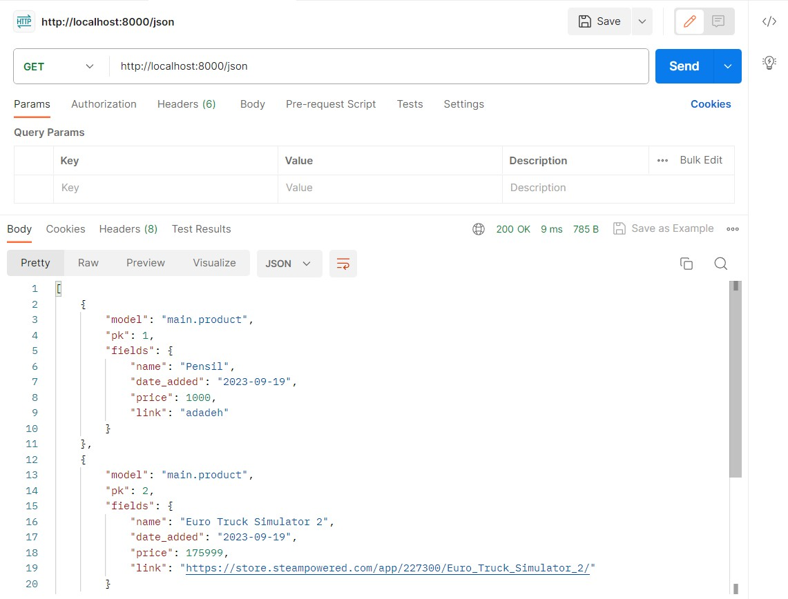
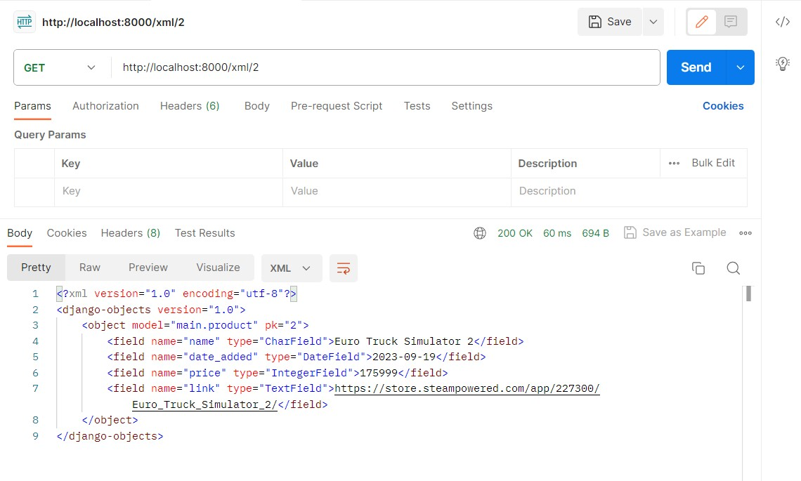
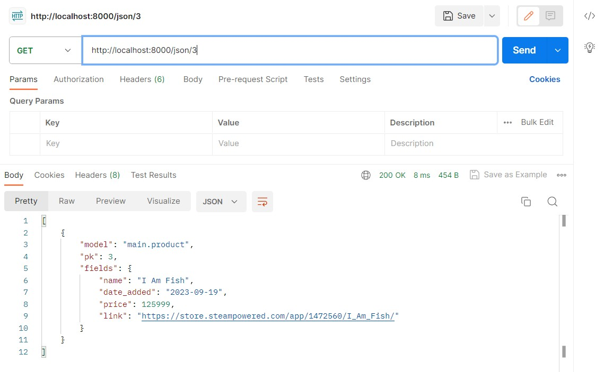

Repository Untuk Deploy Aplikasi pada adaptable.io

## Tugas 6
Jelaskan perbedaan antara asynchronous programming dengan synchronous programming.
:	Asynchronous programming adalah program yang biasanya tidak bersinkronisasi antara beberapa tugas atau bisa dibilang tiap tugas independen tanpa menunggu tugas lainnya. Sedangkan pada Synchronous programming adalah program yang bersinkronisasi antara beberapa tugas atau bergiliran antar tugas (system blocking) sehingga meminimalisir terjadinya race condition.

Dalam penerapan JavaScript dan AJAX, terdapat penerapan paradigma event-driven programming. Jelaskan maksud dari paradigma tersebut dan sebutkan salah satu contoh penerapannya pada tugas ini.
:	Maksud dari paradigma event-driven programming adalah pendekatan dimana eksekusi program berjalan berdasarkan peristiwa seperti onclick dan sebagainya. Pada tugas ini, contoh penerapannya pada ajax create di tombol "create new item", disana memakai onclick yang dimasukkan ketika program pertama dijalankan, sehingga ketika event click terjadi, maka muncul pop-up untuk membuat item terbaru itu.

Jelaskan penerapan asynchronous programming pada AJAX.
:	penerapan asynchronous programming pada AJAX adalah teknik pemrograman web yang memungkinkan web berinteraksi tanpa merefresh halaman tersebut sehingga web lebih responsif dan dinamis, beberapa penerapannya bisa menggunakan fetch API, XMLHttpRequest, dan sebagainya.

Pada PBP kali ini, penerapan AJAX dilakukan dengan menggunakan Fetch API daripada library jQuery. Bandingkanlah kedua teknologi tersebut dan tuliskan pendapat kamu teknologi manakah yang lebih baik untuk digunakan.
:	Perbedaan dari kedua tersebut adalah Fetch API hanya digunakan untuk sekedar menerima permintaan dan response HTTP, sedangkan pada library jQuery memiliki lebih banyak fitur. Kedua teknologi mempunyai pangsa pasarnya masing-masing, untuk Fetch API lebih ringan dan mudah sehingga cocok untuk web yang tidak terlalu mementingkan fitur, sedangkan library jQuery lebih berat dan sulit untuk diimplementasikan sehingga cocok untuk web besar yang memang membutuhkan banyak fitur.

Jelaskan bagaimana cara kamu mengimplementasikan checklist di atas secara step-by-step (bukan hanya sekadar mengikuti tutorial).
:	1. Mengubah list item yang sebelumnya tanpa ajax, menjadi menggunakan ajax GET.
	2. Lalu mengubah cara menambahkan item yang awalnya harus ke halaman lain dan selalu merefresh halaman menjadi pop-up dan hanya merefresh list item saja.
 	3. Mengerjakan README.md.

## Tugas 5
Jelaskan manfaat dari setiap element selector dan kapan waktu yang tepat untuk menggunakannya.
:	Manfaat dari element selector adalah untuk menerapkan tampilan umum pada suatu element seperti halnya <button></button> yang pasti mempunyai border dan animasi button. Waktu yang tepat digunakan ketika ingin memberikan base design untuk element tertentu. seperti ingin menggunakan font times new roman pada 

.

Jelaskan HTML5 Tag yang kamu ketahui.
:	<header> bisa dianalogikan sebagai kotak untuk menampung element yang ingin ditaruh di header seperti logo, judul, navigation bar, search bar, dan element yang biasanya ada pada bagian paling atas sebuah aplikasi web.
	<footer> bisa dianalogikan sebagai kotak untuk menampung element yang ingin ditaruh di footer seperti about us, contact, logo, dan element yang biasanya ada pada bagian paling bawah sebuah aplikasi web.
	<aside> bisa dianalogikan sebagai kotak untuk menampung element yang ingin ditaruh di samping. Hanya beberapa web saja yang memakainya, yang paling jelas ada pada web scele.

Jelaskan perbedaan antara margin dan padding.
:	Margin adalah bagian luar dari suatu element setelah border. Biasanya digunakan untuk memberi jarak antara element agar tidak terlalu dekat. Sedangkan untuk padding adalah bagian dalam dari suatu element sebelum border. Padding ini lebih variasi digunakan seperti backgroud, jarak element dengan border. Hal yang bisa dibedakan adalah pada padding termasuk pada Pseudo-class seperti hover, sedangkan pada margin tidak masuk. sehingga ketika element tersebut menggunakan hover dan mengubah background-color. maka akan berubah ketika kursor pada bagian element hingga border.

Jelaskan perbedaan antara framework CSS Tailwind dan Bootstrap. Kapan sebaiknya kita menggunakan Bootstrap daripada Tailwind, dan sebaliknya.
:	Tailwind CSS lebih sulit digunakan, tetapi bisa lebih leluasa untuk kreatif dan perubahan. Sedangkan pada Bootstrap lebih mudah digunakan, tetapi lebih sulit untuk melakukan perubahan.

Jelaskan bagaimana cara kamu mengimplementasikan checklist  di atas secara step-by-step.
: 	saya menggunakan Bootstrap untuk framework, dan menaruh pada base.html.
	Saya juga menambahkan delete dan edit pada inventori.
	Lalu menghubungkan css yang ada pada folder static di folder project. walau masih bingung cara terbaik untuk menambahkan css.
	Mengubah background color, padding dan margin agar terlihat lebih rapih.

## Tugas 4
Apa itu Django UserCreationForm, dan jelaskan apa kelebihan dan kekurangannya?
:	UserCreationForm adalah sebuah framework yang biasanya digunakan untuk membuat form registrasi user pada aplikasi web. Kelebihan framework tersebut ada pada penggunaan yang mudah karena sudah menjadi default pada Django sendiri, validasi otomatis, dan juga terintegrasi pada model User. Akan tetapi framework ini terbatas pada Model bawaan Django, tetapi hal itu bisa diatasi dengan customization.

Apa perbedaan antara autentikasi dan otorisasi dalam konteks Django, dan mengapa keduanya penting?
:	Sistem otentikasi Django sendiri menangani keduanya, singkatnya autentikasi ditujukan untuk memverifikasi pengguna, sedangkan pada otorisasi ditujukan untuk menentukan apa saja yang boleh dilakukan oleh pengguna yang diverifikasi. Dan kenapa keduanya penting, misalkan jika tanpa ada verifikasi, maka pengguna anonymus bisa melakukan apa saja, sedangkan jika tidak ada otorisasi, maka tidak ada batasan diantara semua pengguna dalam mengakses fitur pada aplikasi web.

Apa itu cookies dalam konteks aplikasi web, dan bagaimana Django menggunakan cookies untuk mengolah data sesi pengguna?
:	cookies adalah sebuah penyimpanan sementara, atau dalam konteks sistem komputer, cookies bisa dianalogikan sebagai ram (penyimpanan kecil, tetapi efisien). Cookies sendiri hanya memiliki size maksimal 4mb, tetapi itu sudah cukup untuk menyimpan informasi login, memungkinkan website menyediakan konten yang lebih personal, menyimpan pengaturan pada web, dan biasanya sebagai faktor dalam menentukan iklan yang muncul. Django menyimpan cookies dalam bentuk variable dan value. Ketika Django ingin mengakses dengan request.COOKIES.get(variable) akan mendapatkan value dari variable cookies tersebut.

Apakah penggunaan cookies aman secara default dalam pengembangan web, atau apakah ada risiko potensial yang harus diwaspadai?
:	Secara default dalam pengembangan web, cookies bersifat private yang hanya bisa dilihat melalui komputer pribadi. Maka bisa dibilang aman untuk penggunaan pada komputer pribadi. Akan tetapi jika menggunakan komputer umum, maka hati-hati pada cookies, sebab informasi penting bisa terlihat. Maka dari itu lebih baik menghapus cookies pada website ketika menggunakan komputer umum.

Jelaskan bagaimana cara kamu mengimplementasikan checklist di atas secara step-by-step (bukan hanya sekadar mengikuti tutorial).
:	1. Saya membuat login.html dan register.html. Lalu membuat fungsinya pada views.py dan membuat path pada urls.py.
	2. Mengatur tampilan main agar sesuai dengan user yang sedang login.
	3. Lalu saya juga membuat max_attempt untuk login, ketika sudah 3 kali, maka website menyarankan untuk membuat akun baru.
	4. Lalu saya juga menset cookies ketika login dilakukan, dan menghapus cookies ketika logout dilakukan.

## Tugas 3
Apa Perbedaan antara POST dan GET dalam Django?
:	Perbedaan diantara POST dan GET adalah cara mereka mengirim data kita ke database. 
	1. Untuk POST pengirim data dilakukan secara secret, sedangkan pada GET pengiriman data dilakukan secara terbuka sehingga pada url terlihat data yang dikirim, sedangkan pada POST tidak terlihat. 
	2. POST juga tidak dibatasi panjang string, sedangkan GET dibatasi sampai 2047 Karakter.
	3. POST digunakan untuk mengirim data-data penting dan yang lebih dari 2047 Karakter, sedangkan pada GET digunakan untuk data-data yang tidak penting.

Apa perbedaan utama antara XML,JSON, dan HTML dalam konteks pengiriman data?
:	Perbedaan utama bisa dilihat dari kegunaan serta cara penyajian/penyimpanan data.
	1. Pada XML, penyimpanan data dilakukan dengan fleksibilitas yang tinggi. XML juga dapat mendefinisikan struktur data.
	2. Pada JSON, lebih ringan diatara keduanya, sehingga biasa digunakan untuk pengiriman data dari server ke klien.
	3. Pada HTML, biasanya digunakan pada tampilan web. Biasanya didampingi dengan CSS agar tampilan lebih menarik.

Mengapa JSON sering digunakan dalam pertukaran data antara aplikasi web modern?
:	Seperti pada soal sebelumnya, pertukaran data antara server dengan klien lebih ringan menggunakan JSON. Dengan JSON, kerja server lebih ringan dan lebih cepat sampai pada klien dan dapat lebih banyak menampung klien.

Jelaskan bagaimana cara kamu mengimplementasikan checklist di atas secara step-by-step
:	Berikut step-by-step mengimplementasikan checklist diatas:
	1. Saya Membuat Kerangka tampilan web, menambahkan isi pada content web berupa table untuk main.html dan tampilan form untuk create_product.html
	2. Saya menambahkan objek model yang sebelumnya berupa name, amount, description menjadi name, price, dan link.
	3. Saya membuat fungsi views.py untuk melihat data dalam bentuk HTML, JSON, XML, JSON by ID, dan XML by ID.
	4. Lalu menambahkan routing URL pada masing-masing fungsi.
	5. Pada main.html, yang sebelumnya description hanya memasukkan String, saya merubahnya dengan link dengan memakai <a href="{{product.link}}">link</a> agar dapat dibuka dengan mudah.

Mengakses kelima URL di poin 2 menggunakan Postman, membuat screenshot dari hasil akses URL pada Postman, dan menambahkannya ke dalam README.md.
1. Postman with HTML

2. Postman with XML

3. Postman with JSON

5. Postman with XML by ID

6. Postman with JSON by ID

## Tugas 2
Jelaskan bagaimana cara kamu mengimplementasikan checklist step-by-step?
: 	1. Membuat Repository baru dengan nama BananaApp untuk projectnya, lalu membuat Repository baru lagi dengan nama BananaAppAdaptable untuk main app.
	2. Membuat model pada aplikasi dengan name, amount, dan description dengan tipe yang ditentukan
	3. Membuat fungsi pada views.py untuk mengembalikan templates/main.html untuk menampilkan nama aplikasi, nama, serta kelas.
	4. Melakukan deploy app di adaptable dengan repo BananaAppAdaptable dan sudah dapat diakses via online dengan link.

Buatlah bagan yang berisi request client ke web aplikasi berbasis Django beserta responnya dan jelaskan pada bagan tersebut kaitan antara urls.py, views.py, models.py, dan berkas html.

Jelaskan mengapa kita menggunakan virtual environment? apakah kita tetap dapat membuat aplikasi web berbasis Django tanpa menggunakan virtual environment?
: Alasan mengapa kita menggunakan virtual environment adalah untuk membuat lingkungan isolasi yang terpisah untuk setiap proyek python, menjadi lebih bersih dan terorganisir, dan dengan mudah membagikan proyek ke orang lain. Tetapi kita tetap dapat membuat aplikasi web berbasis Django tanpa menggunakan virtual environment, tetapi itu tidak disarankan.

Jelaskan apakah itu MVC, MVT, MVVM dan perbedaan dari ketiganya.
: MVC adalah Model-View-Control dengan pemisahan yang strict antara Model, View, dan Controller. Perubahan yang satu jarang mempengaruhi yang lainnya
MVT adalah Model-View-Template, biasanya digunakan jika berfokus pada tampilan atau Template
MVVM adalah Model-View-ViewModel dengan tujuan memperkecil kode pada View dan berfokus pada tampilan dan interaksi pengguna.
